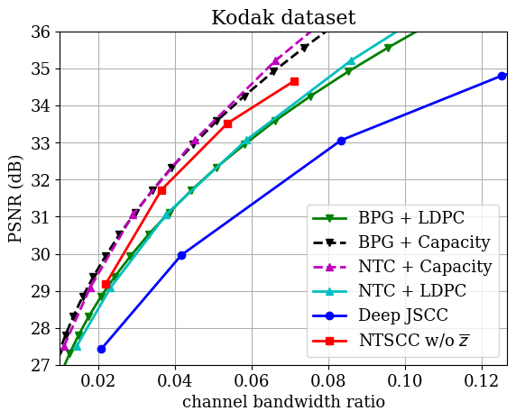

# Nonlinear Transform Source-Channel Coding for Semantic Communications

Pytorch Implementation of JSAC 2022 Paper "Nonlinear Transform Source-Channel Coding for Semantic Communications"

Arxiv Link: https://arxiv.org/abs/2112.10961

Project Page: https://semcomm.github.io/ntscc/

## Prerequisites
* Python 3.8 and [Conda](https://www.anaconda.com/)
* CUDA 11.0
* Environment
    ```
    conda create -n $YOUR_PY38_ENV_NAME python=3.8
    conda activate $YOUR_PY38_ENV_NAME
    
    pip install torch==1.7.1+cu110 torchvision==0.8.2+cu110 torchaudio==0.7.2 -f https://download.pytorch.org/whl/torch_stable.html
    python -m pip install -r requirements.txt
    ```
  
## Usage


Example of test the PSNR model:
```bash
python main.py --phase test --checkpoint path_to_checkpoint
```

## Pretrained Models

Pretrained models (optimized for MSE) trained from scratch using randomly chose 500k images from the OpenImages dataset.

* Download [NTSCC w/o z models](https://drive.google.com/drive/folders/1qNRu_08-O5-lkqo3Sht48FCLITqqK6t-?usp=sharing) and put them into ./checkpoints folder.

Other pretrained models will be released successively.

Note: We reorganize code and the performances are slightly different from the paper's.

>  RD curves on [Kodak](http://r0k.us/graphics/kodak/), under AWGN channel SNR=10dB.


## Citation
If you find the code helpful in your research or work, please cite:
```
@ARTICLE{9791398,
  author={Dai, Jincheng and Wang, Sixian and Tan, Kailin and Si, Zhongwei and Qin, Xiaoqi and Niu, Kai and Zhang, Ping},
  journal={IEEE Journal on Selected Areas in Communications}, 
  title={Nonlinear Transform Source-Channel Coding for Semantic Communications}, 
  year={2022},
  volume={40},
  number={8},
  pages={2300-2316},
  doi={10.1109/JSAC.2022.3180802}
  }
```

## Acknowledgements
The NTSCC model is partially built upon the [Swin Transformer](https://github.com/microsoft/Swin-Transformer) and [CompressAI](https://github.com/InterDigitalInc/CompressAI/). We thank the authors for sharing their code.


